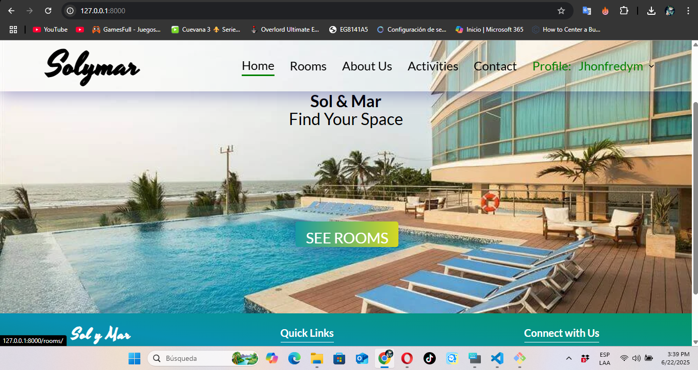
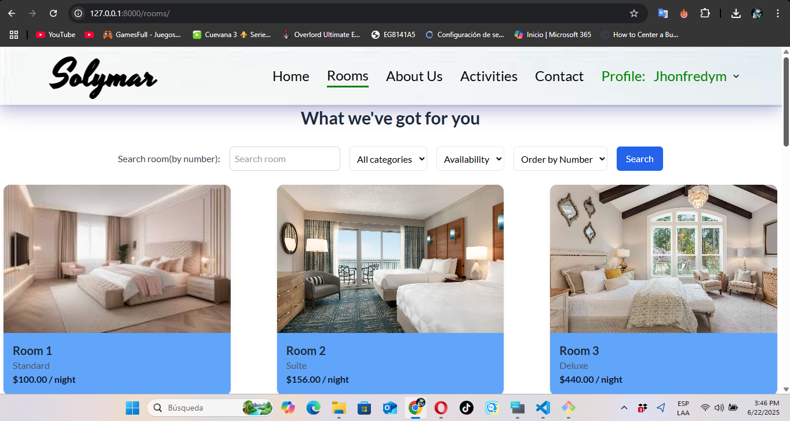
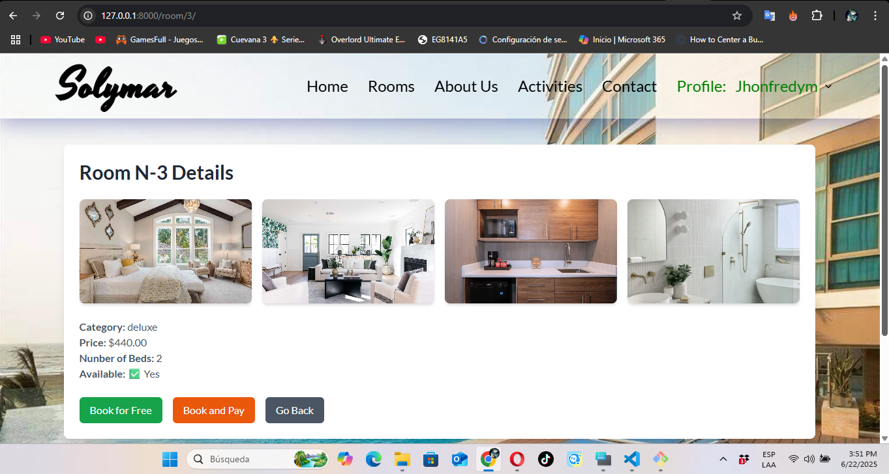
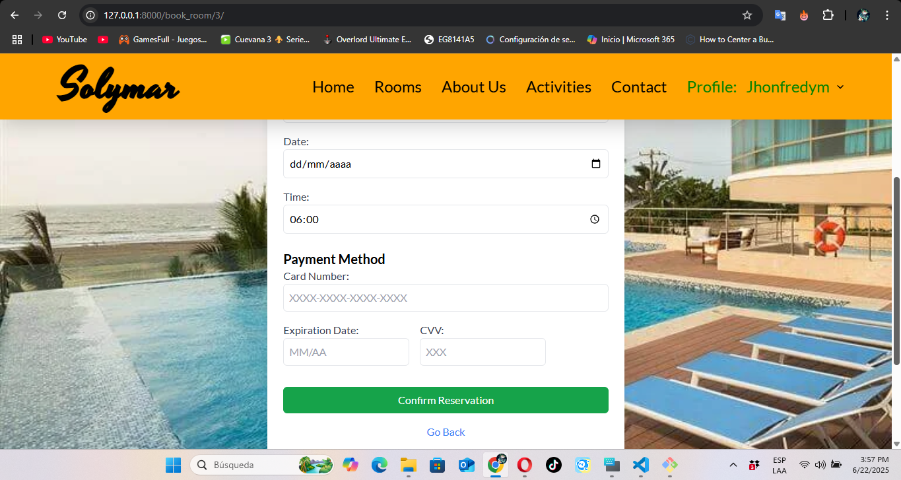

#  Web App for Hotel Reservations

Web application developed with Django to manage reservations, rooms, and guests at a beach resort hotel. It offers a simple interface for users and an efficient admin dashboard for the staff.

The project was practically finished when I decided to make a repository and work with git. That means that the first commits will contain the majority of my work. The main focus now will be to improve the base.html layout so that the footer is not covered by the content in the header.

---

## 🚀 Characteristics

- User registration and authentication.
- Reservations with availability validation.
- Administration panel with reservation, customer and room management.
- Sending of confirmation emails.
- Modern interface with Tailwind CSS and Crispy Forms.
- Gallery management with fancybox.

---

## 🛠️ Technologies

- Python 3.10+
- Django 5.1
- SQLite (dev mode)
- Tailwind CSS
- Crispy Forms with `crispy-tailwind`
- HTML, CSS and Javascript

---

## ⚙️ Instalation

1. Clone this repository:
   
   git clone https://github.com/jhonfredy7777/HotelWeb.git
   

2. Inside the repository, create and activate a virtual environtment:
   ### 1️ Create virtual environment

**On Windows (cmd or PowerShell)**:
```bat
python -m venv env
```

**On Git Bash / Linux / Mac**:
```bash
python3 -m venv env
```

---

   ### Activate virtual environment

**On Command Prompt (cmd)**:
```bat
.\env\Scripts\activate.bat
```

**On Git Bash**:
```bash
source env/Scripts/activate
```

**On Linux/Mac**:
```bash
source env/bin/activate
```

**On PowerShell**:
```powershell
.\env\Scripts\Activate.ps1
```
> 💡 If script execution is restricted in PowerShell, run:
> ```powershell
> Set-ExecutionPolicy RemoteSigned -Scope CurrentUser
> ```
> Then accept with `S` and press Enter.


3. Install dependencies:
   pip install -r requirements.txt

4. Configure environment variables:
   Create a file called .env in the root of the project with the following contents:
      SECRET_KEY=put-your-secret-key-here
      EMAIL_HOST_USER=your-email@gmail.com
      EMAIL_HOST_PASSWORD=your-app-password
   You can generate a secret key with this command in Python:
      from django.core.management.utils import get_random_secret_key
      print(get_random_secret_key())
      - if using gitbash: python -c "from django.core.management.utils import get_random_secret_key; print(get_random_secret_key())"
 

5. Apply migrations, load rooms data, create superuser(optional) and run the server:
   python manage.py migrate
   python manage.py loaddata rooms.json
   python manage.py createsuperuser
   python manage.py runserver

6. Access in your browser:
   http://127.0.0.1:8000/

---
## 📸 Screenshots





## Usage
Run the website (python manage.py runserver), go to your local host `http://127.0.0.1:8000/` and create all the reservations you want. Play with it.

## Contributions
Contributions are welcome! Open an issue or make a pull request.


## 📄 Licence
MIT © 2025 Jhon Fredy
   


